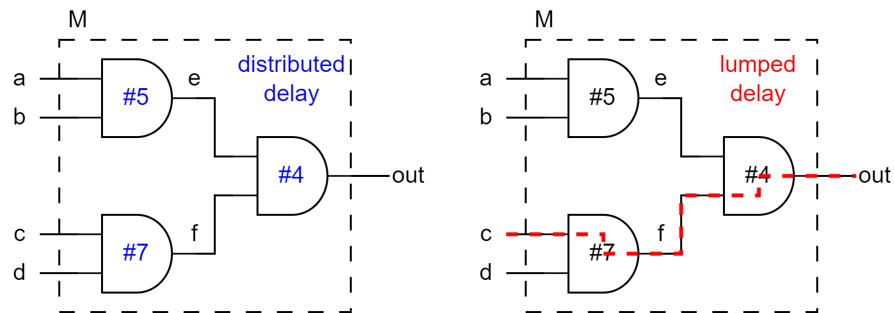
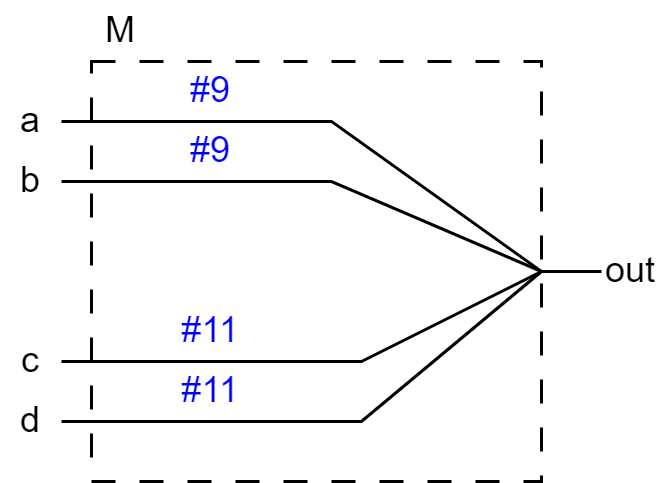
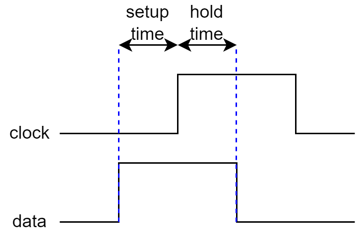
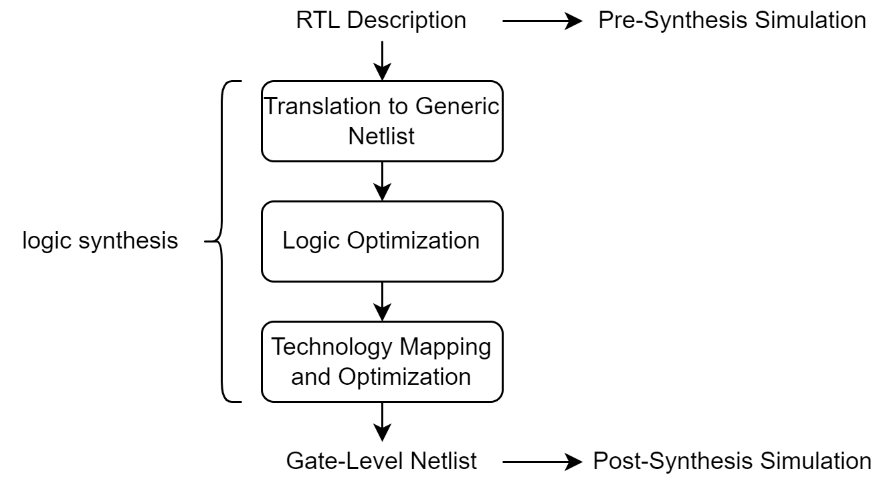

# VER-09 | Timing, Delay Modeling & Synthesis

1. [Distributed Delay vs. Lumped Delay](#1-distributed-delay-vs-lumped-delay)
2. [Path Delay Modeling with `specify` Blocks](#2-path-delay-modeling-with-specify-blocks-pin-to-pin-delay)
3. [Timing Checks: `$setup` / `$hold` / `$width`](#3-timing-checks-setup--hold--width)
4. [Min:Typ:Max Delay Selection](#4-mintypmax-delay-selection)
5. [Synthesizable vs. Non-Synthesizable Constructs](#5-synthesizable-vs-non-synthesizable-constructs)
6. [Latch Inference from Incomplete Conditionals](#6-latch-inference-from-incomplete-conditionals)
7. [Writing Technology-Independent Combinational RTL](#7-writing-technology-independent-combinational-rtl)
8. [Synthesis Tool Overview: Yosys](#8-synthesis-tool-overview-yosys)
9. [Synthesis + Gate-Level Simulation Flow](#9-synthesis--gate-level-simulation-flow)

## 1. Distributed Delay vs. Lumped Delay

Two ways to attach a delay value to the same logic function
`out = (a & b) & (c & d)`:

- **Distributed delay** - each primitive gate gets its own `#delay`. The
  simulator can react as soon as any single gate's inputs change, so partial
  changes (only `a`/`b` moving, `c`/`d` staying put) propagate at their own,
  shorter delay.
- **Lumped delay** - every internal gate is delay-free; the module's whole
  worst-case delay is placed on the one gate that drives the output. Simpler
  to write, but every change looks like it takes the worst-case path, even
  when it didn't.



See
[examples/VER-09/00-distributed-lumped-delay.v](../../examples/VER-09/00-distributed-lumped-delay.v):
both models agree on worst-case delay (7+4 = 11), but only the
distributed model reacts faster when just one half of the logic changes.

## 2. Path Delay Modeling with `specify` Blocks (Pin-to-Pin Delay)

Rather than annotating individual gates, a `specify`/`endspecify` block
attaches delay directly to **input -> output pin pairs** of a module - useful
when you only have a datasheet's pin-to-pin timing and don't want to (or
can't) model the internal gates at all.

```verilog
specify
    specparam fast = 9, slow = 11;
    (a => out) = fast;  // parallel connection: source bit -> matching dest bit
    (b => out) = fast;
    (c => out) = slow;
    (d => out) = slow;
    // full connection (*>): every source bit drives every dest bit
    // (a, b *> out) = fast;
endspecify
```



See
[examples/VER-09/10-path-delay-specify.v](../../examples/VER-09/10-path-delay-specify.v).
**Icarus Verilog parses `specify` syntax but does not evaluate it** - path
delays only take effect in ModelSim, and only when told to compile them:

```
python run_modelsim.py VER-09/10-path-delay-specify --specify
```

## 3. Timing Checks: `$setup` / `$hold` / `$width`

Timing-check system tasks live inside a `specify` block and make the
simulator itself flag constraint violations - no testbench assertions
needed:

| task | violation condition |
|---|---|
| `$setup(data, posedge clk, limit, notifier)` | `data` changes less than `limit` before the clock edge |
| `$hold(posedge clk, data, limit, notifier)` | `data` changes less than `limit` after the clock edge |
| `$width(posedge clk, limit)` | the clock pulse stays high for less than `limit` |



See
[examples/VER-09/20-timing-checks.v](../../examples/VER-09/20-timing-checks.v)
- run it in ModelSim with `--specify` and watch for a `$setup` violation
message around t=10, where `d` changes only 2ns before an edge that requires
3ns of setup.

## 4. Min:Typ:Max Delay Selection

A single delay number is optimistic - real silicon's delay varies with
process, voltage, and temperature (PVT). `#(min:typ:max)` gives three delay
values for the same transition, and the *simulator* (not the source code)
picks which one to use for a given run:

- **min** - best-case corner, used to check hold-time margins
- **typ** - nominal corner, everyday functional simulation
- **max** - worst-case corner, used to check setup-time margins

See
[examples/VER-09/30-min-typ-max-delay.v](../../examples/VER-09/30-min-typ-max-delay.v).
Icarus always simulates the `typ` value; select a corner in ModelSim with
this project's `--delay-mode` flag:

```
python run_modelsim.py VER-09/30-min-typ-max-delay --delay-mode min
python run_modelsim.py VER-09/30-min-typ-max-delay --delay-mode max
```

## 5. Synthesizable vs. Non-Synthesizable Constructs

Everything in Section 1~4 - `#delay`, `specify` blocks, `$setup`/`$hold`/`$width` -
describes *simulation* timing only. None of it maps to real gates, and a
synthesis tool either ignores it or rejects it outright. The synthesizable
subset of Verilog is much narrower than the simulatable subset:

| construct | synthesizable? |
|---|---|
| `assign`, `always @(*)` combinational logic | yes |
| `always @(posedge clk)` sequential logic | yes |
| `#delay` | no (ignored) |
| `specify` / `$setup` / `$hold` / `$width` | no (ignored or rejected) |
| `initial` blocks, `$display`/`$monitor`/`$finish` | no (simulation-only) |
| `force`/`release` | no (simulation-only, see VER-08) |

The rule of thumb: if a construct describes *when* something happens in
wall-clock time, or talks to the simulator's console, it isn't hardware.

## 6. Latch Inference from Incomplete Conditionals

A combinational `always` block must assign every output on every possible
path through the block. If a branch is missing (no `else`, or a `case`
without a `default`), the tool must generate a latch to hold the output's
previous value for the uncovered case - almost always **not** what was
intended:

```verilog
// No else: control == 0 leaves out unassigned -> synthesizes to a latch.
always @(control or a)
    if (control) out = a;
```

vs.

```verilog
// Every branch assigns out -> synthesizes to a clean mux.
always @(control or a or b)
    if (control) out = a;
    else out = b;
```

This is unusual among synthesis-only pitfalls in that it's visible in plain
simulation too, not just in the gate-level netlist - `bad_latch`'s output
visibly "gets stuck" on the last driven value instead of tracking `b`.

See
[examples/VER-09/40-mux-vs-latch.v](../../examples/VER-09/40-mux-vs-latch.v).

**Confirming it in an actual netlist**: synthesize `bad_latch` and `good_mux` separately and compare their cell counts.

```powershell
$env:PATH = "C:\oss-cad-suite\bin;C:\oss-cad-suite\lib;$env:PATH"
yosys -p "read_verilog -D SYNTH examples/VER-09/40-mux-vs-latch.v; hierarchy -top bad_latch; proc; opt; techmap; opt; stat"
yosys -p "read_verilog -D SYNTH examples/VER-09/40-mux-vs-latch.v; hierarchy -top good_mux; proc; opt; techmap; opt; stat"
```

(`-D SYNTH` defines the `SYNTH` macro so `` `ifndef SYNTH `` in the source
excludes the `testbench` module - Yosys elaborates `initial` blocks while
reading a file and would otherwise abort on the testbench's `$finish` before
any synthesis pass runs.)

Yosys's own `proc` pass reports the difference directly, during the
`PROC_DLATCH` step:

```
# bad_latch:
Warning: Latch inferred for signal `\bad_latch.\out' from process `\bad_latch.$proc$...'

# good_mux:
No latch inferred for signal `\good_mux.\out' from process `\good_mux.$proc$...'
```

And the final `stat` cell counts confirm it - `bad_latch` synthesizes to a
single latch cell, `good_mux` to a single mux cell, nothing else:

```
=== bad_latch ===        === good_mux ===
1 cells                  1 cells
  1 $_DLATCH_P_             1 $_MUX_
```

If you also want the actual netlist saved to a file, add `write_verilog
-noexpr <path>` to the end of either command above - but keep `bad_latch`
and `good_mux` as two separate `yosys -p "..."` calls like this (each launch
of `yosys.exe` starts from a clean, empty design). Pasting both into one
already-running interactive `yosys` session without a `design -reset`
between them leaves the first module still loaded when the second
`write_verilog` runs, and it's easy to write out the wrong module under the
wrong filename as a result.

**Always pass `-noexpr`.** By default `write_verilog` translates Yosys's own
internal single-bit cells (`$_AND_`, `$_MUX_`, `$_DLATCH_P_`, ...) back into
behavioral-looking Verilog (`assign`/`always @*`) for readability - so a
netlist you haven't actually looked at with `stat` can look deceptively like
it was never synthesized at all. `-noexpr` keeps them as explicit named
instances instead, e.g. `` \$_DLATCH_P_  out_reg (.D(a), .E(control),
.Q(out)); `` - what an actual gate-level netlist should look like:

```
write_verilog -noexpr examples/VER-09/40-mux-vs-latch.bad_latch.synth.v
```

## 7. Writing Technology-Independent Combinational RTL

A synthesizable description should express *what* the logic computes, not
*how* a particular gate library implements it - that mapping is the
synthesis tool's job. Comparison operators (`>`, `<`, `==`) are a good
example: they read like the mathematical intent and let the tool pick
whatever gate structure is smallest/fastest for the target.

```verilog
module magnitude_comparator (
    output A_gt_B, A_lt_B, A_eq_B,
    input  [3:0] A, B
);
    assign A_gt_B = (A > B);
    assign A_lt_B = (A < B);
    assign A_eq_B = (A == B);
endmodule
```

See
[examples/VER-09/50-magnitude-comparator.v](../../examples/VER-09/50-magnitude-comparator.v)
- deliberately simple, so it's a good first module to push through an actual
synthesis tool in Section 9.

## 8. Synthesis Tool Overview: Yosys

This machine has Yosys installed (via the
[oss-cad-suite](https://github.com/YosysHQ/oss-cad-suite-build) distribution)
at `C:\oss-cad-suite`. Its `yosys.exe` needs its sibling `lib` directory on
`PATH` too (for its bundled DLLs) or it fails to start at all, so add both
before running it:

```powershell
$env:PATH = "C:\oss-cad-suite\bin;C:\oss-cad-suite\lib;$env:PATH"
yosys -V
```

[Yosys](https://yosyshq.net/yosys/) is an open-source Verilog synthesis
tool. Given RTL, it elaborates the design's hierarchy, converts behavioral
constructs (`always` blocks, `case`/`if`) into a generic internal gate
representation, then technology-maps that down to concrete gate primitives.
A minimal synthesis script looks like:

```
read_verilog design.v   # parse RTL into Yosys's internal representation
hierarchy -top <name>   # pick the top module, prune anything unreachable from it
proc                     # convert always blocks into a generic netlist (mux/dff cells)
opt                      # generic logic optimization
techmap                  # map generic cells down to simulatable gate primitives
opt                      # clean up after techmap
write_verilog out.v      # emit the gate-level netlist as structural Verilog
```

## 9. Synthesis + Gate-Level Simulation Flow



Synthesize
[50-magnitude-comparator.v](../../examples/VER-09/50-magnitude-comparator.v)'s
`magnitude_comparator` module, then re-run its own testbench unchanged
against the resulting gate-level netlist instead of the original RTL - if
both give identical `$monitor` output, synthesis preserved behavior.

**1. Synthesize with Yosys** (only the DUT, not the testbench module, gets
mapped to gates). `-D SYNTH` is required here, not just a style choice -
Yosys elaborates `initial` blocks while reading a file, so without it Yosys
would reach the testbench's `$finish` and abort before any synthesis pass
runs at all:

`-noexpr` is included so the netlist keeps explicit named gate instances
(`$_AND_`, `$_XOR_`, ...) instead of `write_verilog`'s default of folding
them back into `assign`/`always` behavioral syntax - see Section 6 for why that
default is misleading to look at:

```powershell
$env:PATH = "C:\oss-cad-suite\bin;C:\oss-cad-suite\lib;$env:PATH"
yosys -p "read_verilog -D SYNTH examples/VER-09/50-magnitude-comparator.v; hierarchy -top magnitude_comparator; proc; opt; techmap; opt; write_verilog -noexpr examples/VER-09/50-magnitude-comparator.synth.v"
```

**2. Gate-level simulate in ModelSim.** The netlist Yosys writes out uses
its internal simulation primitives (`$_AND_`, `$_XOR_`, ...), so ModelSim
also needs their behavioral models from Yosys's own cell library
(`simcells.v`, at `C:\oss-cad-suite\share\yosys\simcells.v`) compiled
alongside. Compiling the original source file's `testbench` module together
with the netlist's `magnitude_comparator` would define that module twice, so
`+define+GATELEVEL` excludes the RTL copy (see the `` `ifndef GATELEVEL ``
guard in the source) and keeps only the synthesized one:

```powershell
$env:PATH = "C:\intelFPGA\20.1\modelsim_ase\win32aloem;$env:PATH"
vlib work
vlog "C:\oss-cad-suite\share\yosys\simcells.v"
vlog examples/VER-09/50-magnitude-comparator.synth.v
vlog +define+GATELEVEL examples/VER-09/50-magnitude-comparator.v   # testbench module only
vsim -c work.testbench -do "run -all; quit -f"
```

Confirmed working end-to-end: comparing this run's `$monitor` output against
a plain behavioral run (`python run_modelsim.py VER-09/50-magnitude-comparator`)
gives the same sequence of `A_gt_B`/`A_lt_B`/`A_eq_B` values in the same
order - the gate-level netlist behaves like the RTL it came from. One
cosmetic difference: the printed `$time` values come out 1000x larger here
(e.g. `t=10000` instead of `t=10`) because neither the generated netlist nor
`simcells.v` carries a `` `timescale `` directive, so they fall back to a
different default time precision than the testbench's own `` `timescale 1ns
/ 1ps ``. It's a reporting-scale artifact, not a functional mismatch - every
value still changes in the same relative order.

**3. (Simplest) Formal equivalence checking - skip simulation entirely.**
Steps 1-2 only prove the netlist matches the RTL for the handful of input
combinations the testbench happens to drive. Yosys can instead *prove*
equivalence for every possible input, with no ModelSim involved at all:
read the RTL as a "gold" reference, synthesize a second copy as the "gate"
netlist, then hand both to `equiv_make`/`equiv_simple`/`equiv_status`:

```powershell
$env:PATH = "C:\oss-cad-suite\bin;C:\oss-cad-suite\lib;$env:PATH"
yosys -p "read_verilog -D SYNTH examples/VER-09/50-magnitude-comparator.v; rename magnitude_comparator gold; design -stash gold; read_verilog -D SYNTH examples/VER-09/50-magnitude-comparator.v; synth -top magnitude_comparator; rename magnitude_comparator gate; design -stash gate; design -copy-from gold -as gold gold; design -copy-from gate -as gate gate; equiv_make gold gate equiv; hierarchy -top equiv; equiv_simple; equiv_status -assert"
```

Confirmed working: this prints `Equivalence successfully proven!` for
`magnitude_comparator`. `equiv_status -assert` makes Yosys exit with an
error if any output turns out *not* equivalent, so this same command works
unattended (e.g. in a script or CI) with no output-parsing needed - unlike
the simulation route, which requires eyeballing or diffing `$monitor` text.
