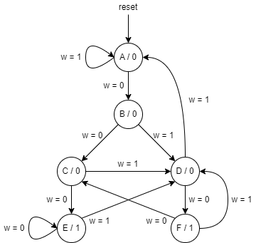

# FSM from a State Diagram

Consider the state machine shown below, which has one input `w` and one
output `z`.

Implement this state machine. `reset` is a synchronous, active-high reset
that brings the machine back to state `A`, regardless of the current state.
