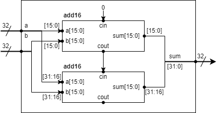

# Hierarchical 32-bit Adder Design

You are given a module `add16` that performs a 16-bit addition. Instantiate
two of them to create a 32-bit adder.

- One `add16` module computes the lower 16 bits of the result.
- The second `add16` module computes the upper 16 bits of the result, after
  receiving the carry-out from the first adder.

Your 32-bit adder does not need to handle carry-in (assume 0) or carry-out
(ignored), but the internal `add16` modules need carry-in/carry-out in order
to function correctly. In other words, `add16` performs 16-bit
`a + b + cin`, while your `top_module` performs 32-bit `a + b`.

Connect the modules together as shown in the diagram below.



The provided `add16` module has the following declaration:

```verilog
module add16 (
    input  [15:0] a,
    input  [15:0] b,
    input         cin,
    output [15:0] sum,
    output        cout
);
```

## Module Declaration

```verilog
module top_module (
    input  [31:0] a,
    input  [31:0] b,
    output [31:0] sum
);
```
